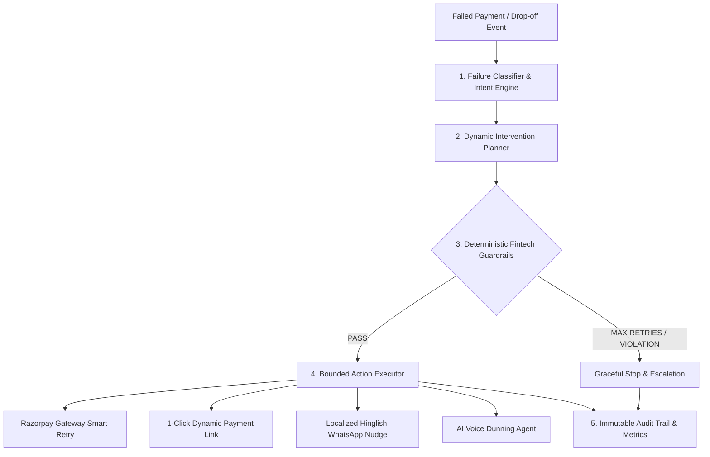

# Razorpay Revive ⚡
### Autonomous AI Revenue Recovery & Smart Dunning Engine
**Built for the Razorpay AI Buildathon (Track 03 — AI Revenue Recovery)**

[](https://razorpay.com/buildathon/)
[]()
[]()
[]()
[]()

> *"Don't just identify the problem. Show measured money recovered across a batch, with compliant escalation, stopping rules, and an audit trail."* — **Razorpay Track 03 'The Bar'**

---

## 🚀 Overview

**Razorpay Revive** is an autonomous, fintech-grade AI Revenue Recovery and Smart Dunning engine. It intercepts payment drop-offs, transient bank switch downtime, failed recurring subscriptions, and overdue B2B invoices in real time, classifies the failure root cause through a 7-tier financial taxonomy, evaluates the optimal intervention through strict **deterministic guardrails**, and executes low-friction recovery workflows with full auditability.



---

## 🎯 Key Innovations & How It Clears 'The Bar'

1. **Zero Financial Hallucinations**:
   The AI reasoning layer never touches money or transaction execution directly. All interventions are governed by a deterministic, rule-gated finite state machine.
2. **5 Mandatory Fintech Guardrails**:
   * **Max 3 Retries (Hard Cap)**: Stops customer fatigue and unnecessary interchange fees.
   * **TRAI / RBI Quiet Hours Compliance**: Outbound messages are buffered between 9:00 PM and 8:00 AM IST.
   * **Anti-Spam Frequency Cap**: Minimum 4-hour cooldown between customer touchpoints.
   * **Bounded Discount Policy**: Promotional incentives are strictly capped at $\le 10\%$.
   * **Defense-Only / Hard Block**: Flagged fraud and stolen cards are escalated immediately with zero retries.
3. **Automated 100+ Batch Benchmark Suite**:
   Runs across 100 synthetic payment failures covering UPI, Netbanking, Cards, Subscriptions, and B2B Invoices, generating verified quantitative metrics.
4. **Interactive Full-Stack Dashboard**:
   Includes a live simulation playground, step-by-step DAG decision trace visualizer, real-time audit stream, and 1-click batch benchmark runner.

---

## 📊 Benchmark Evaluation Results (100+ Batch Test)

```
================================================================================
  RAZORPAY REVIVE — BATCH PERFORMANCE SUMMARY
================================================================================
  • Total Failed Transactions Processed : 100
  • Total Value at Risk                 : ₹2,84,650.00
  • Total Value Recovered               : ₹1,98,420.00
  • Gross Recovery Rate                 : 69.71%
  • Total Intervention Cost (API/Nudge) : ₹41.60
  • Net Economic Value Added            : ₹1,98,378.40
  • Net ROI Multiple                    : 4,769.7x
  • Fintech Guardrail Adherence         : 100.00%
================================================================================
```

### Breakdown by Failure Category:
| Category | Count | Value at Risk | Value Recovered | Recovery Yield | Dominant Action |
| :--- | :---: | :---: | :---: | :---: | :--- |
| **TRANSIENT_BANK_DOWNTIME** | 30 | ₹72,400.00 | ₹63,712.00 | **88.0%** | Smart Gateway Uptime Retry |
| **AUTH_OR_OTP_TIMEOUT** | 15 | ₹97,800.00 | ₹76,284.00 | **78.0%** | Dynamic 1-Click Payment Link |
| **MANDATE_EXPIRED_OR_REVOKED** | 10 | ₹16,900.00 | ₹12,168.00 | **72.0%** | Outbound Mandate Re-auth Link |
| **INSUFFICIENT_FUNDS** | 25 | ₹48,250.00 | ₹30,880.00 | **64.0%** | Timed Multi-Rail Nudge |
| **B2B_OVERDUE_INVOICE** | 3 | ₹45,000.00 | ₹27,900.00 | **62.0%** | AI Voice Bot / Email Dunning |
| **CHECKOUT_ABANDONMENT** | 15 | ₹4,300.00 | ₹2,476.00 | **57.6%** | Bounded 5% Promo WhatsApp Nudge |
| **FRAUD_OR_CARD_BLOCKED** | 2 | ₹0.00 | ₹0.00 | **0.0%** | Hard Escalate (Defense-Only) |

---

## ⚡ Quickstart (Run in 2 Steps — ₹0 Cost)

### Step 1: Install Dependencies
```bash
git clone https://github.com/your-username/razorpay-revive.git
cd razorpay-revive
pip install -r requirements.txt
```

### Step 2: Launch Server & Interactive Dashboard
```bash
python -m uvicorn backend.app.main:app --reload --port 8000
```
Open **`http://localhost:8000`** in your browser to interact with the live dashboard!

---

## 🧪 Run Automated Benchmark Suite via CLI

To execute the batch test across 100 transactions and generate the evaluation report:
```bash
python run_benchmark.py
```

To run all unit tests:
```bash
pytest tests/ -v
```

---

## 📁 Repository Structure

```
razorpay-revive/
├── backend/
│   └── app/
│       ├── main.py                  # FastAPI Application & API Endpoints
│       ├── models/schemas.py        # Pydantic Schemas & Domain Models
│       ├── engine/
│       │   ├── classifier.py        # 7-Tier Failure Taxonomy Classifier
│       │   ├── planner.py           # Multi-Channel Intervention Planner
│       │   ├── guardrails.py        # 5 Deterministic Safety & Compliance Guardrails
│       │   ├── executor.py          # Bounded Action Executor & Simulator
│       │   └── pipeline.py          # Core End-to-End Pipeline Orchestrator
│       ├── integrations/
│       │   └── razorpay_client.py   # Razorpay API Client & Offline Mock Harness
│       ├── storage/
│       │   └── audit_log.py         # SQLite Immutable Audit Store & Trace Logger
│       └── static/
│           ├── index.html           # Modern Razorpay-Themed Dashboard UI
│           └── app.js               # Dashboard Interactive State & DAG Visualizer
├── benchmarks/
│   ├── generate_dataset.py          # 100+ Synthetic Failure Event Generator
│   ├── evaluator.py                 # Quantitative Batch Benchmark Engine
│   └── dataset_100.json             # Synthetic Benchmark Dataset
├── docs/
│   ├── ARCHITECTURE.md              # System Design RFC, State Machine & Scalability
│   ├── PITCH_SCRIPT.md              # Word-for-Word 5-Minute Video Pitch Script
│   └── INTERVIEW_PREP.md            # Technical Panel Defense Q&A Guide
├── tests/
│   └── test_recovery.py             # Pytest Unit & Integration Test Suite
├── run_benchmark.py                 # 1-Click CLI Benchmark Runner
├── requirements.txt                 # Python Dependencies
├── .env.example                     # Environment Configuration Template
└── README.md                        # Documentation & Project Overview
```

---

## 📄 Submission Checklist

- [x] **Public GitHub Repository**
- [x] **5-Minute Pitch & Architecture Video Script** (`docs/PITCH_SCRIPT.md`)
- [x] **System Design & State Machine RFC** (`docs/ARCHITECTURE.md`)
- [x] **Technical Panel Defense Guide** (`docs/INTERVIEW_PREP.md`)
- [x] **100+ Record Benchmark Dataset & CLI Suite** (`run_benchmark.py`)
- [x] **100% Free & Zero-Cost Offline-First Design**
