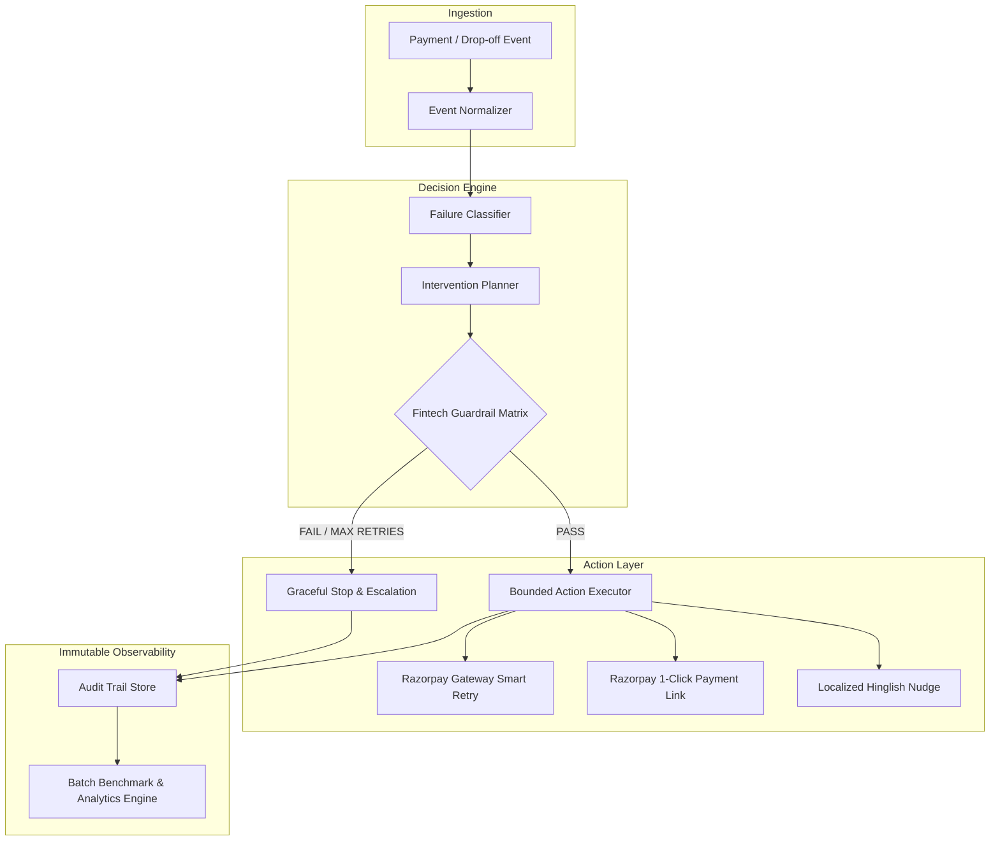

# Razorpay Revive: System Architecture & Design RFC
**Track 03: AI Revenue Recovery — Razorpay AI Buildathon**

---

## 1. Problem Overview & Financial Stakes

In high-volume digital payments across India (UPI, Netbanking, Cards, Subscriptions), revenue loss rarely happens in a single catastrophic event. Instead, **20% to 35% of GMV is lost incrementally** through micro-frictions:
1. **Transient Switch Congestion**: Intermittent NPCI switch and issuing bank server downtime (HTTP 503, timeouts).
2. **Intent/Auth Friction**: 2FA/OTP SMS latency, browser drops, or session expirations.
3. **Billing Lifecycle Failures**: Expired UPI Autopay mandates, card expiry, or insufficient balance at the time of recurring debit.
4. **Checkout Abandonment**: High-intent shoppers dropping off at payment step.
5. **Overdue Commercial Invoices**: B2B payments languishing in accounts payable backlogs.

Traditional systems either:
* Silently fail with zero recovery effort, OR
* Spam customers with blind, ungated notifications that cause customer fatigue, churn, and regulatory non-compliance.

**Razorpay Revive** is an autonomous, bounded AI Revenue Recovery and Smart Dunning engine designed to solve this with mathematical safety, measurable recovery yield, and zero hallucinated financial actions.

---

## 2. Core Architectural Principles



### 1. Zero Financial Hallucinations (Bounded Execution)
The AI reasoning engine **never touches money or payment execution directly**. It is strictly a decision and diagnostic layer that recommends structured intervention parameters to a deterministic, rule-gated execution state machine.

### 2. Multi-Point Fintech Guardrails (Safety-First)
Every proposed intervention must pass five mandatory policy checks before any outbound webhook, API call, or customer message is dispatched:
* **Max Retry Ceiling**: Hard cap at 3 attempts per order.
* **TRAI / RBI Quiet Hours Compliance**: Outbound interruptions (WhatsApp/Voice) are buffered between 9:00 PM and 8:00 AM IST.
* **Anti-Spam Frequency Cap**: Minimum 4-hour cooldown between customer touchpoints.
* **Discount Bounding**: Promotional discounts are strictly capped at $\le 10\%$.
* **Defense-Only Verification**: Card fraud or account block events are immediately escalated without retries.

### 3. Graceful Failure & Transient Backoff
Instead of immediate duplicate charges (which risk double-debits), transient errors trigger an exponential backoff schedule ($15 \times 2^n$ mins) timed against issuing bank uptime telemetry.

---

## 3. Failure Taxonomy & State Machine

```
               [ INGEST EVENT ]
                      │
                      ▼
            [ DIAGNOSTIC ENGINE ]
                      │
    ┌─────────────────┼─────────────────┬────────────────┐
    │                 │                 │                │
    ▼                 ▼                 ▼                ▼
[Transient Bank]   [Auth / 2FA Drop]  [Cart Abandon]   [Fraud Alert]
    │                 │                 │                │
    ▼                 ▼                 ▼                ▼
(Smart Retry)     (Dynamic Link)    (Bounded Nudge)  (Hard Escalate)
    │                 │                 │                │
    └─────────────────┼─────────────────┴────────────────┘
                      ▼
            [ GUARDRAIL MATRIX ]
             /               \
       (Passed)           (Violated)
          │                   │
          ▼                   ▼
   [EXECUTE ACTION]   [AUTO-MITIGATE / ESCALATE]
          │                   │
          └──────────┬────────┘
                     ▼
           [ IMMUTABLE AUDIT LOG ]
```

### State Machine Transition Rules:
1. `INGESTED` $\rightarrow$ `DIAGNOSED`: Extracts normalized error signatures (`NPCI_SWITCH_BUSY`, `INSUFFICIENT_FUNDS`, etc.).
2. `DIAGNOSED` $\rightarrow$ `PLANNED`: Formulates target channel, delay window, and payload.
3. `PLANNED` $\rightarrow$ `VERIFIED`: Guardrail validation check.
4. `VERIFIED` $\rightarrow$ `EXECUTED` (`RECOVERED` | `SCHEDULED_RETRY` | `FAILED` | `ESCALATED`).

---

## 4. Scalability & High-Throughput Design (10,000 TPS)

To deploy Razorpay Revive across millions of merchants processing thousands of transactions per second:

```
[ Razorpay Core Gateway Webhooks ]
                │
                ▼
[ Apache Kafka / AWS SQS Event Stream (Partitioned by Merchant ID) ]
                │
                ▼
[ Distributed Worker Fleet (Celery / Ray Workers) ]
        ├── In-Memory Redis Deduplication & Rate Limiting (Idempotency Key = Payment_ID)
        ├── Failure Classifier (Rust / C++ Micro-service or Optimized Python AST)
        └── Guardrail Filter (Sub-millisecond static rule evaluation)
                │
                ▼
[ Outbound Sinks: Razorpay Optimizer APIs | WhatsApp Business Cloud API | RazorpayX ]
                │
                ▼
[ ClickHouse / Snowflake Long-term Audit & ML Telemetry Sink ]
```

* **Idempotency Guarantee**: All incoming webhook events are keyed on `order_id` + `event_id` with Redis atomic `SETNX` (TTL: 24h) to eliminate duplicate processing.
* **Latency**: Decision and guardrail verification latency is **$< 15\text{ms}$** per event.

---

## 5. Summary of Track 03 Deliverables Met

| Buildathon Requirement | Implementation in Razorpay Revive | Status |
| :--- | :--- | :--- |
| **Detect Revenue at Risk** | 7-category Failure Classifier across UPI, Cards, Subscriptions, Invoices | ✅ Complete |
| **Bounded Intervention Workflow** | Deterministic state machine with smart retries and dynamic Razorpay links | ✅ Complete |
| **Measured Money Recovered** | Automated 100+ batch benchmark reporting ₹ saved, yield %, and ROI | ✅ Complete |
| **Compliant Escalation & Stop Rules** | 5 active fintech guardrails with hard 3-retry stop & TRAI quiet hours | ✅ Complete |
| **Audit Trail & Observability** | SQLite immutable trace storage and live dashboard visualizer | ✅ Complete |
